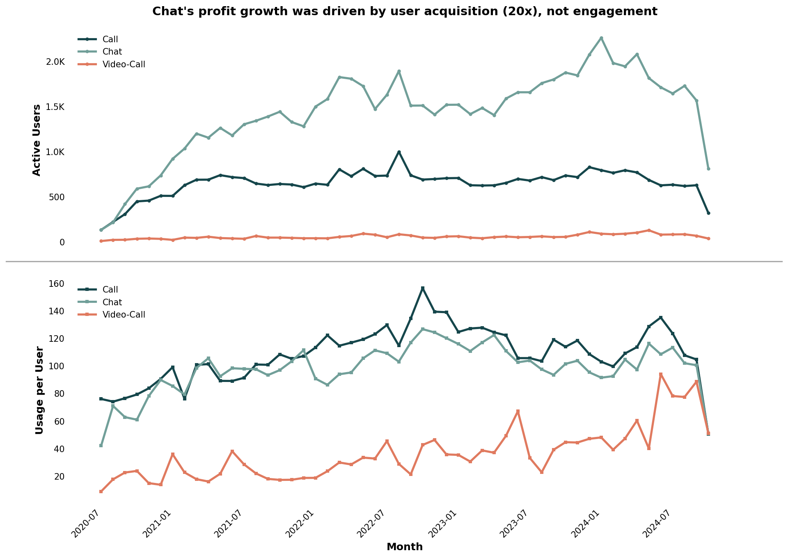
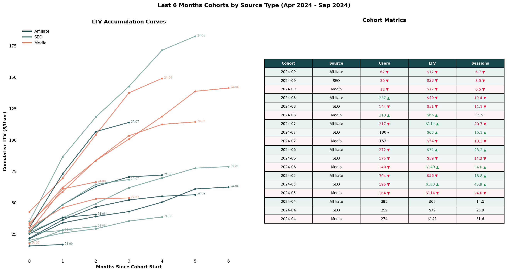

<p align="center">
  
</p>

# SaaS Marketplace Analysis: Online Psychology Service

A comprehensive data analysis of a **two-sided SaaS marketplace** connecting clients with licensed mental health professionals. This analysis examines growth patterns, user retention, channel performance, and supply-side economics for a digital therapy platform.

**Dataset:** 2.4M transactions | **Time Period:** 2020-2024 | **Clients:** 36K+ | **Providers:** 1,178 psychologists

---

## Marketplace Overview

This SaaS platform operates as a **two-sided marketplace** connecting clients seeking mental health support with licensed psychologists. The platform facilitates therapy sessions through three communication channels: **Call**, **Chat**, and **Video-Call**.

**Business Model:**
- **Demand side:** Clients seeking therapy, counseling, and mental health support
- **Supply side:** Licensed psychologists providing remote sessions
- **Revenue:** Platform commission on completed sessions

The marketplace's success depends on balancing supply and demand, optimizing client-provider matching, maximizing provider utilization, and building long-term client relationships.

---

## Goals of the Analysis

The purpose of this analysis is to provide management with a clear, data-driven understanding of the company's acquisition efficiency, client retention, and service quality performance.

Specifically, this analysis aims to assist management in:
- Scale high-performing acquisition channels
- Improve client retention and lifetime value
- Ensure high-quality mental health outcomes

---

## Executive Summary

This analysis reveals key insights about the business:

1. **Chat drives growth** - 60% of profit growth came from Chat, primarily through user acquisition (20x growth), not increased engagement
2. **Critical churn point** - 40-60% of users never return after their first session across all service types
3. **SEO brings quality, Affiliate brings scale** - SEO users generate 2x higher LTV but with greater variance
4. **Supply concentration risk** - 35% of psychologists generate 80% of monthly profit

➡️ See [Actionable Recommendations](#actionable-recommendations) for strategic next steps.

---

## 1. Profit Structure

### Chat Became the Primary Profit Engine


**What the chart shows:**
Monthly profit trend from 2020-2024 across three service types: Call, Chat, and Video-Call.

**Trend over time:**
From 2020 through early 2021, both Chat and Call grew rapidly, reaching similar profit levels of ~$40K-$50K/month. Starting mid-2021, Chat continued to scale consistently, while Call growth slowed and began stabilizing. By mid-2022, Chat had clearly separated, reaching ~$130K-$150K/month, while Call fluctuated within a narrower range of ~$90K-$130K/month without sustained upward momentum.

Between 2023 and 2024, Chat maintained strong growth and reached its peak near ~$200K/month, becoming the dominant profit contributor. In contrast, Call remained stable with moderate fluctuations but showed no structural growth beyond its earlier peak. Video-Call showed gradual improvement over time, increasing from near zero in 2020 to ~$10K-$15K/month by 2024, but its contribution remained small relative to Chat and Call.

**Insight:** Chat became the primary driver of profit growth due to sustained expansion over multiple years, while Call transitioned into a mature, stable revenue source without continued scaling. Video-Call shows early positive momentum but has not yet reached meaningful profit scale.

---

## 2. Growth Driver: Acquisition vs Engagement

### Chat's Profit Growth Was Driven by User Acquisition (20x), Not Engagement



**What the chart shows:**
Two-panel analysis showing Active Users (top) and Usage per User (bottom) by service type from 2020-2024.

**Upper panel (Active Users):**
Chat's growth was driven primarily by a sharp increase in active users, expanding from ~150 users in 2020 to over 2,000 at peak in 2024 (>10x growth). In contrast, Call users grew modestly early on and then plateaued around ~600-800 users, while Video-Call remained a small but gradually growing segment.

**Lower panel (Usage per User):**
Engagement per user did not increase alongside Chat's user growth. Chat usage per user rose initially from ~40 to ~120 sessions per user by 2022, but then stabilized and slightly declined through 2023-2024 despite continued user acquisition. Meanwhile, Call consistently maintained the highest engagement per user (~100-150), and Video-Call showed steady improvement over time, increasing from ~10 to ~80+ usage per user, indicating strengthening engagement among a smaller but increasingly committed user base.

**Insight:** Chat's profit growth was driven primarily by scaling acquisition volume rather than improving engagement depth, whereas Call and Video-Call demonstrate stronger per-user engagement, suggesting deeper therapy continuity and higher relationship intensity per client.

---

## 3. Lifecycle Bottleneck

### Session 1→2 is the Critical Churn Point: 40-60% Never Return


**What the chart shows:**
Two-panel analysis: Left panel shows churn distribution by session number. Right panel shows retention curves for each service type.

**Left panel (Churn Distribution):**
The highest churn occurs during the first session, with ~24-38% of users leaving immediately depending on the service. The second session represents the next largest drop-off, contributing an additional ~20-30% churn. After session 2, churn rates decline sharply, with each additional session contributing progressively smaller losses.

**Right panel (Retention Curves):**
Cumulative churn reaches ~50-60% by session 2, after which retention stabilizes. Call maintains the strongest long-term retention, with ~15-18% of users still active after 20 sessions, while Chat stabilizes around ~10-12%, and Video-Call declines further to ~7-8%.

**Insight:** The first two sessions determine the majority of retention outcomes. Users who continue beyond session 2 are significantly more likely to remain long-term clients, particularly in Call services.

---

## 4. Supply Side Analysis (Providers)

### 35% of Psychologists Generate 80% of Monthly Profit


**What the chart shows:**
Two-panel analysis of monthly profit distribution across 1,178 active psychologists.

**Left panel (Profit Concentration):**
The cumulative curve shows that the top ~35% of psychologists generate ~80% of total monthly profit. Beyond this point, the curve flattens, indicating that the majority of psychologists contribute relatively little incremental revenue. The steep early slope confirms that revenue is driven disproportionately by top-performing psychologists, while the long tail contributes minimal profit.

**Right panel (Psychologist Profit Tiers):**
The distribution shows that 82% of psychologists generate less than $500/month, while only 8% generate more than $1,000/month. High-revenue psychologists are rare but disproportionately important.

**Business Implication:** Revenue growth depends more on psychologist productivity than psychologist count. Scaling revenue requires retaining top-performing psychologists and improving the productivity of mid-tier providers, rather than relying solely on increasing the total number of psychologists.

---

## 5. Demand Side Analysis (Client Acquisition)

### SEO and Media Generate Higher Long-Term Value



**What the chart shows:**
Combined view of LTV accumulation curves (left) and metrics table (right) for cohorts from April 2024 to September 2024, segmented by acquisition source.

**LTV Curves (Left):**
SEO and Media cohorts generate significantly higher long-term LTV compared to Affiliate. Early cohorts (Apr-Jun 2024) demonstrate the strongest performance, with SEO cohorts reaching ~$170-$185 LTV within 4-5 months and Media cohorts reaching ~$140-$150. In contrast, Affiliate cohorts grow more slowly and plateau earlier, typically reaching only ~$60-$110 LTV.

**Cohort Metrics (Right):**
Higher LTV cohorts are associated with higher engagement levels. For example, the May 2024 SEO cohort achieved the highest LTV ($183) alongside the highest sessions per user (45.9), while Affiliate cohorts show consistently lower LTV ($40-$114) and lower session counts (10-23).

**Insight:** SEO and Media channels acquire users who engage more deeply and generate higher long-term value, while Affiliate provides more stable but lower-value users. LTV growth is strongly correlated with session depth, indicating that user engagement quality-not just acquisition volume-drives long-term revenue.

---

## Actionable Recommendations

### 1. Fix the First-Session Experience (Highest Impact)

**Why:** 40-60% of users churn after session 1 - this is the largest revenue leakage point.

**Product**
- Improve therapist-client matching accuracy (preferences, specialization, urgency)
- Add onboarding to set expectations (what therapy looks like, timeline, outcomes)
- Ensure faster first response time, especially in Chat

**Customer Success**
- Trigger follow-up within 24h after first session
- Send structured next-session recommendation

---

### 2. Convert Chat Users into Call/Video-Call Users (Increase LTV)

**Why:** Call and Video-Call users show higher engagement and long-term value.

**Product**
- Recommend Call/Video-Call after 2-3 Chat sessions
- Add therapist recommendation prompts: "This conversation may benefit from a live session"

**Marketing / Lifecycle**
- Target engaged Chat users with Video-Call upgrade offers

---

### 3. Retain and Scale Top-Performing Psychologists (Maximize Profit per Provider)

**Why:** 35% of psychologists generate 80% of total profit - revenue is highly concentrated among a small group.

**Product / Provider Experience**
- Identify characteristics of top-performing psychologists (specialization, response time, session frequency) and replicate through hiring and training
- Prioritize exposure of high-performing psychologists in therapist matching and recommendations

**Customer Success / Operations**
- Monitor early warning signals of declining activity among top psychologists and intervene proactively
- Reduce operational friction for top performers (scheduling tools, workload optimization)

**Growth / Supply Strategy**
- Recruit psychologists with profiles similar to top performers
- Upskill mid-tier psychologists using best practices from top-performing providers

---

### 4. Scale SEO Acquisition (Highest-Value Channel)

**Why:** SEO users generate up to 2x higher lifetime value.

**Marketing**
- Increase investment in SEO content targeting high-intent therapy keywords
- Identify top-performing SEO cohorts and replicate content strategy

**Growth Analytics**
- Identify which keywords produce highest LTV clients

---

## Repository Structure

```
├── README.md                    # This file
└── images/                      # All visualization outputs
    ├── monthly_profit_by_service_type.png
    ├── users_vs_usage_story.png
    ├── churn_analysis.png
    ├── cohort_ltv_curves.png
    ├── cohorts_curves_and_table.png
    ├── monthly_profit_per_psychologist.png
    ├── source_type_analysis.png
    └── refund_rate_over_time.png
```

---

*Analysis generated February 2026*
